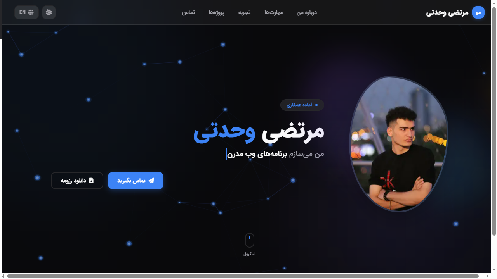

<div align="center" dir="rtl">

# مرتضی وحدتی — رزومه

یک سایت رزومه‌ی تک‌صفحه‌ای دوزبانه (فارسی / انگلیسی)، ساخته‌شده با App Router نکست.

**[English](README.md) · [فارسی](README.fa.md)**

</div>

---

<div align="center">

|                  روشن — انگلیسی                   |                 تیره — فارسی                  |
| :------------------------------------------------: | :-------------------------------------------: |
|  |  |

</div>

---

<div dir="rtl">

## درباره

یک سایت رزومه‌ی شخصی که فارسی را زبان درجه‌یک می‌داند، نه یک لایه‌ی ترجمه. چیدمان به راست‌چین آینه می‌شود، فونت به IRANSans محلی تغییر می‌کند و تاریخ پروژه‌ها از میلادی به شمسی تبدیل می‌شود — همه از یک فایل JSON.

## امکانات

- **دوزبانه (fa / en)** — مسیرهای پیشوند‌دار با زبان، مذاکره‌ی `Accept-Language` و کوکی‌ای که انتخاب را به یاد می‌سپارد
- **راست‌چین واقعی** — جهت، آینه شدن چیدمان و تعویض فونت، نه فقط `dir="rtl"`
- **تم روشن / تیره** — به‌صورت پیش‌فرض از سیستم‌عامل پیروی می‌کند و پس از انتخاب باقی می‌ماند
- **محتوا به‌عنوان داده** — هر فیلد رزومه در یک فایل JSON است؛ کامپوننت‌ها هرگز محتوا را hardcode نمی‌کنند
- **فرم تماس** — گاردهای لایه‌لایه ضد اسپم (مبدأ، تله‌ی عسل، زمان‌سنجی، محدودیت نرخ بر پایه‌ی IP) با خطاهای دوزبانه
- **سئو** — تگ‌های canonical و hreflang، نقشه‌ی سایت، robots، وب‌منیفست و JSON-LD از نوع Person، همه از همان داده
- **تست سرتاسری** — ۶۵ تست Cypress شامل ناوبری، هر دو زبان، فرم، گاردهای API و خروجی سئو

## پشته‌ی فنی

| حوزه       | انتخاب                                        |
| ---------- | --------------------------------------------- |
| فریم‌ورک   | Next.js 14 (App Router)، React 18             |
| زبان       | TypeScript (strict)                           |
| استایل     | Tailwind CSS، متغیرهای CSS، `next-themes`     |
| انیمیشن    | Framer Motion                                 |
| چندزبانگی  | Negotiator + `@formatjs/intl-localematcher`   |
| ایمیل      | Nodemailer (SMTP، اختیاری)                    |
| تست        | Cypress (E2E)                                 |

## شروع به کار

```bash
npm install
cp .env.example .env    # اختیاری: تنظیمات SMTP برای فرم تماس
npm run dev             # http://localhost:3000
```

برنامه مسیر `/` را بر اساس کوکی و سپس زبان مرورگر به `/fa` یا `/en` هدایت می‌کند.

## دستورها

```bash
npm run dev            # سرور توسعه روی پورت ۳۰۰۰
npm run build          # بیلد پروداکشن (تایپ‌چک هم می‌کند)
npm run lint           # ESLint
npm run cypress:open   # تست تعاملی
npm run cypress:run    # تست headless — به سرور در حال اجرا نیاز دارد
npm run screenshots    # بازتولید تصاویر README
```

## متغیرهای محیطی

همه‌ی متغیرها اختیاری‌اند. بدون SMTP، فرم تماس همچنان پیام را می‌پذیرد و `emailSent: false` برمی‌گرداند، به‌جای نمایش خطایی که بازدیدکننده کاری از دستش برنمی‌آید.

| متغیر                                 | کاربرد                                                     |
| ------------------------------------- | ---------------------------------------------------------- |
| `SITE_URL`                            | مبنای canonical/hreflang، دامنه‌ی نقشه‌ی سایت و robots، مبدأ مجاز فرم، و baseUrl سایپرس |
| `SMTP_HOST` `SMTP_PORT` `SMTP_USER` `SMTP_PASS` | ترابری ایمیل                                     |
| `FROM_EMAIL` `CONTACT_TO`             | فرستنده و گیرنده‌ی پیام‌های تماس                            |

> در پروداکشن `SITE_URL` باید دامنه‌ی عمومی واقعی باشد — مقدار محلی در آنجا آدرس‌های `localhost` را به موتورهای جستجو می‌فرستد.

## ویرایش محتوا

هر چیزی که در صفحه دیده می‌شود از [data/resume.json](data/resume.json) می‌آید، به‌صورت جفت‌های `{ en, fa }`:

```jsonc
{
  "personal": {
    "name": { "en": "Morteza Vahdati", "fa": "مرتضی وحدتی" },
    "role": { "en": "Web Developer", "fa": "برنامه‌نویس وب" }
  }
}
```

تایپ‌های تایپ‌اسکریپت از خود JSON مشتق می‌شوند، پس افزودن یک فیلد تایپ‌ها را هم به‌روز می‌کند — شمای جداگانه‌ای برای هماهنگ نگه داشتن وجود ندارد.

## تست

سایپرس مقابل یک سرور زنده اجرا می‌شود، پس اول یکی بالا بیاورید:

```bash
npm run build && npm run start   # یا npm run dev
npm run cypress:run
```

| اسپک                | پوشش                                            |
| ------------------- | ----------------------------------------------- |
| `home.cy.ts`        | رندر بخش‌ها، `lang`/`dir`، قالب صفحه ۴۰۴          |
| `navigation.cy.ts`  | اسکرول، آفست اسکرول، منوی موبایل                 |
| `intro-locale.cy.ts`| اورلی لودینگ، تغییر زبان، تغییر تم               |
| `contact.cy.ts`     | اعتبارسنجی و ارسال فرم، در هر دو زبان            |
| `api.cy.ts`         | گاردهای API تماس                                 |
| `seo.cy.ts`         | نقشه‌ی سایت، robots، منیفست، JSON-LD، هدرها       |

ارسال‌های فرم تماس stub می‌شوند — زنده گذاشتنشان در هر اجرا به صاحب سایت ایمیل می‌زند.

## استقرار

بدون پیکربندی اضافه روی [Vercel](https://vercel.com) مستقر می‌شود. متغیرهای محیطی را در تنظیمات پروژه قرار دهید، مخصوصاً `SITE_URL`.

## مجوز

پروژه‌ی شخصی. کد برای یادگیری آزاد است؛ محتوای رزومه و عکس‌ها خیر.

</div>
