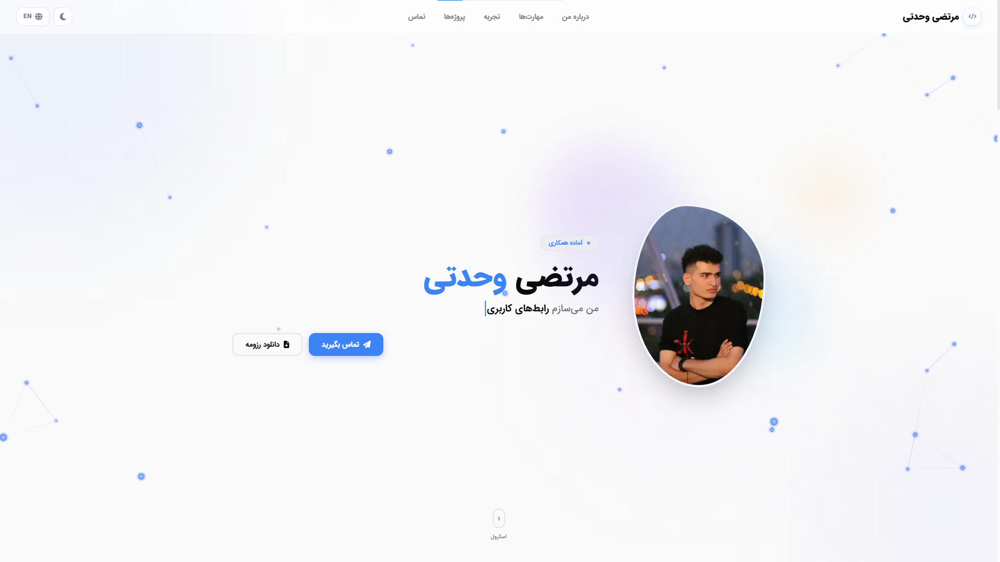
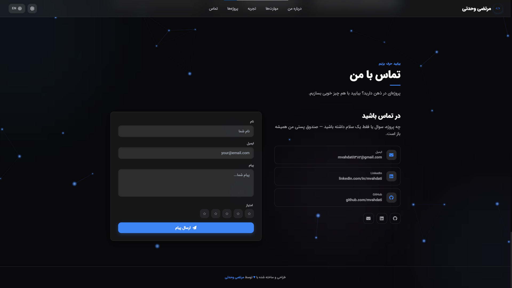

<div align="center" dir="rtl">

# مرتضی وحدتی — پورتفولیو

**یک پورتفولیوی دوزبانه برای نشان‌دادن شیوه‌ی کار من، نه فقط فهرست فناوری‌ها.**

[پورتفولیوی آنلاین](http://morteza-vahdati.vercel.app) · [گیت‌هاب](https://github.com/morteza-vahdati) · **[English](README.md) · [فارسی](README.fa.md)**

</div>

---

<div align="center">

| روشن | تیره |
| :---: | :--: |
|  |  |

</div>

## درباره

این مخزن منبع پورتفولیوی شخصی و دوزبانه‌ی من است. اطلاعات رزومه را به تجربه‌ای وب، ریسپانسیو و قابل‌بررسی تبدیل می‌کند؛ در این تجربه، فارسی و انگلیسی فقط ترجمه‌ی یکدیگر نیستند و هرکدام به‌عنوان یک زبان مستقل ارائه می‌شوند. خود پروژه هم نمونه‌ای از شیوه‌ی کار من است: رابط‌های روشن، پشتیبانی واقعی از راست‌به‌چپ، انیمیشن‌های کنترل‌شده، محتوای داده‌محور و توجه به جزئیات تعاملی.

## نمونه‌کارهای منتخب

هر پروژه با چهار سؤال معرفی می‌شود: زمینه‌ی پروژه چه بوده، نقش من چه بوده، چه چیزی در آن مشارکت کرده‌ام و وضعیت یا مدرک قابل‌بررسی آن چیست. در پروژه‌های تیمی فقط درباره‌ی مشارکت مستند صحبت شده و از افزودن عددهای تأییدنشده خودداری شده است.

### Academist — سامانه‌ی اختصاصی مدیریت

در این سامانه‌ی تیمی، به‌عنوان توسعه‌دهنده‌ی فول‌استک روی ثبت‌نام کاربران، صفحه‌های رزومه، مقالات، محتوای آموزشی و امکانات ارتباطی مشارکت دارم. این پروژه با Next.js، NestJS، TypeScript، Prisma، PostgreSQL، Tailwind CSS و ESLint توسعه داده شده است. احراز هویت، کنترل دسترسی نقش‌محور، داده‌های ساختاریافته و رابط کاربری ریسپانسیو پیاده‌سازی شده‌اند؛ انتشار پروژه هنوز در دست توسعه است.

### Madeliran — پلتفرم اجتماعی سلامت‌محور

از نسخه‌ی اولیه‌ی مادلیران به بعد در این پروژه حضور داشتم و به‌صورت ریموت در توسعه‌ی قابلیت‌های وب با React و TypeScript مشارکت کردم. هماهنگی بین تیم‌ها، برنامه‌ریزی و پیگیری پیشرفت با Trello و جلسه‌های آنلاین انجام می‌شد. [مشاهده‌ی مادلیران](https://madeliran.ir/).

### Portfolio — همین پروژه

این پروژه پورتفولیوی شخصی من با Next.js است و چیدمان انگلیسی و فارسی راست‌به‌چپ، مسیریابی محلی، تم روشن و تاریک، متادیتای سئو، رابط کاربری ریسپانسیو و فرم تماس محافظت‌شده دارد. محتوای آن در [`data/resume.json`](data/resume.json) نگهداری می‌شود تا رابط کاربری و متادیتا از یک منبع دوزبانه تغذیه شوند.

## Features

- **دوزبانه از پایه** — متن‌های انگلیسی و فارسی مستقل و طبیعی، مسیریابی محلی و پشتیبانی واقعی از چیدمان راست‌به‌چپ.
- **ریسپانسیو و مناسب موبایل** — بخش‌های واکنش‌گرا، تصاویر پایدار پروژه، مودال مناسب موبایل، بسته‌شدن منوی موبایل با کلیک بیرون و انیمیشن‌های سبک‌تر در نمایشگرهای کوچک.
- **رابط کاربری آماده‌ی تم** — ذخیره‌ی تم روشن و تاریک، هماهنگی رنگ نوار مرورگر، کنترل‌های دسترسی‌پذیر و توجه به کاهش حرکت.
- **محتوای داده‌محور** — رزومه، مهارت‌ها، تجربه‌ها، جزئیات پروژه‌ها و متن‌های سئو در یک منبع دوزبانه با جفت‌های `{ en, fa }` نگهداری می‌شوند.
- **فرم تماس محافظت‌شده** — بررسی مبدأ، honeypot، اعتبارسنجی زمان ارسال، محدودیت درخواست بر اساس IP، خطاهای دوزبانه و ارسال اختیاری با SMTP.
- **خروجی مناسب موتور جست‌وجو** — متادیتای محلی، canonical و hreflang، sitemap، robots، manifest و JSON-LD از نوع Person.
- **تأیید با تست** — پوشش Cypress برای ناوبری، تغییر زبان، فرم تماس، گاردهای API، سئو، مودال پروژه و تعامل‌های موبایل؛ در مجموع ۶۶ تست.

## اجرای محلی

```bash
npm install
Copy-Item .env.example .env   # در PowerShell
npm run dev
```

سپس `http://localhost:3000` را باز کنید. مسیر ریشه بر اساس زبان ذخیره‌شده و زبان مرورگر، شما را به `/en` یا `/fa` هدایت می‌کند.

```bash
npm run lint           # بررسی ESLint
npm run build          # بیلد production و بررسی typeها
npm run cypress:run   # اجرای تست‌های E2E؛ به سرور فعال نیاز دارد
npm run cypress:open  # اجرای تعاملی Cypress
```

## نقشه‌ی پروژه

```text
src/app/          App Router، layout زبان‌ها، API، متادیتا و مسیرهای crawler
src/components/   layout، بخش‌های صفحه، اجزای UI و JSON-LD
data/resume.json  منبع واحد محتوا و اطلاعات دوزبانه‌ی رزومه و پروژه‌ها
public/           تصاویر، فونت‌ها، اسکرین‌شات‌ها، PDFها و لوگو
cypress/          تست‌های سرتاسری و تنظیمات پشتیبان
```

## متغیرهای محیطی

همه‌ی متغیرها اختیاری‌اند. برای تنظیم SMTP و آدرس عمومی سایت، `.env.example` را به `.env` کپی کنید. در production مقدار `SITE_URL` را روی دامنه‌ی واقعی قرار دهید تا canonical، sitemap، robots و Cypress از میزبان درست استفاده کنند.

## روش ویرایش محتوا

متن‌های قابل‌مشاهده را در [`data/resume.json`](data/resume.json) و به‌صورت جفت‌های `{ en, fa }` ویرایش کنید. هر زبان باید طبیعی نوشته شود، اما ادعاها، تاریخ‌ها، لینک‌ها و میزان قطعیت در هر دو زبان هم‌معنا بماند. کامپوننت‌ها مصرف‌کننده‌ی محتوا هستند و نباید به منبع دوم محتوا تبدیل شوند.

## مجوز

این یک پروژه‌ی شخصی است. استفاده‌ی آموزشی از کد آزاد است؛ محتوای رزومه، تصاویر و داده‌های شخصی برای استفاده‌ی مجدد مجوز داده نشده‌اند.
