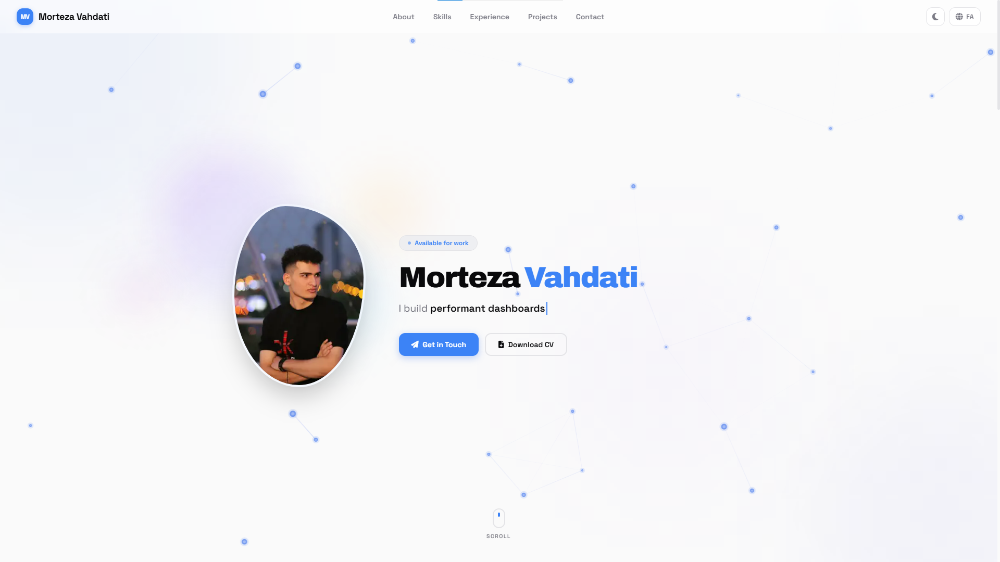
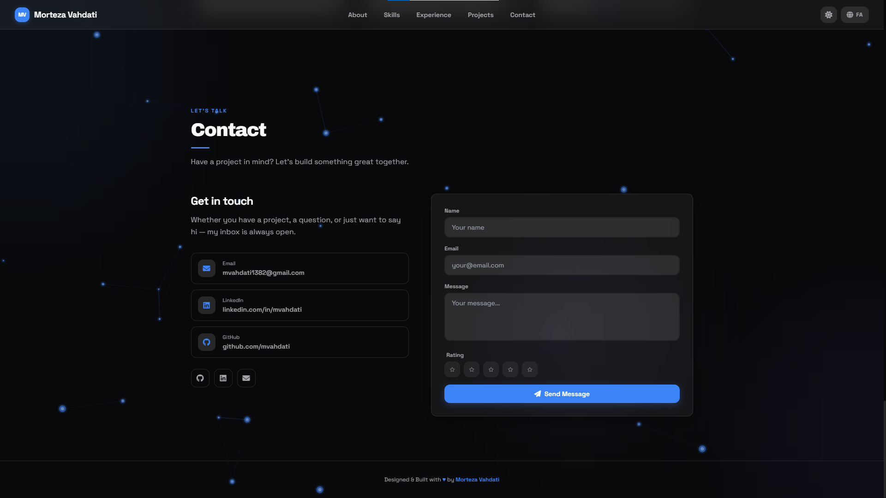

<div align="center">

# Morteza Vahdati — Portfolio

**A bilingual portfolio built to show how I work, not just what I use.**

[Live portfolio](http://morteza-vahdati.vercel.app) · [GitHub](https://github.com/morteza-vahdati) · **[English](README.md) · [فارسی](README.fa.md)**

</div>

---

<div align="center">

| Light | Dark |
| :---: | :--: |
|  |  |

</div>

## The short version

This repository is the source of my personal, bilingual portfolio. It turns resume data into a responsive web experience where English and Persian are independent first-class locales. The project is also a practical demonstration of the way I work: clear interfaces, RTL-aware layout, focused motion, data-driven content, and careful edge cases.

## Selected work

Each project below is described by context, contribution, current state, and evidence. Team projects are written around contribution rather than ownership; unverified metrics are intentionally omitted.

### Academist — custom management system

I contribute as a full-stack developer to a team-built system for user registration, resume pages, articles, educational content, and communication features. The stack includes Next.js, NestJS, TypeScript, Prisma, PostgreSQL, Tailwind CSS, and ESLint. Authentication, role-based access, structured data, and responsive UI are implemented; publication is still in progress.

### Madeliran — health-focused social platform

I participated in Madeliran from its initial version onward, contributing remotely to React and TypeScript web features. Cross-team coordination used Trello and online meetings, with shared planning and project progress as part of the workflow. [Visit Madeliran](https://madeliran.ir/).

### Portfolio — this project

This is a personal Next.js portfolio with English and Persian RTL layouts, locale-aware routing, light/dark themes, SEO metadata, responsive UI, and a protected contact form. Its content is maintained in [`data/resume.json`](data/resume.json), so the UI and metadata grow from one bilingual source.

## Features

- **Bilingual by design** — English and Persian have independent, natural copy with locale-aware routing and real RTL layout support.
- **Responsive and mobile-aware** — responsive sections, stable project imagery, mobile-friendly modals, an outside-click mobile menu, and lighter motion on compact viewports.
- **Theme-ready UI** — light/dark theme persistence, synchronized browser theme color, accessible controls, and reduced-motion considerations.
- **Data-driven content** — resume, skills, experience, project details, and SEO copy are maintained as localized `{ en, fa }` data in one source.
- **Protected contact flow** — origin checks, honeypot detection, timing validation, per-IP rate limiting, bilingual validation, and optional SMTP delivery.
- **Search-friendly output** — localized metadata, canonical and hreflang links, sitemap, robots, manifest, and Person JSON-LD.
- **Proof through tests** — Cypress coverage for navigation, locale switching, contact flows, API guards, SEO, modal behavior, and mobile interactions (66 checks).

## Run locally

```bash
npm install
cp .env.example .env
npm run dev
```

Open `http://localhost:3000`. The root route chooses `/en` or `/fa` from the saved locale and browser language.

```bash
npm run lint           # ESLint
npm run build          # production build and type check
npm run cypress:run   # headless E2E; requires a running server
npm run cypress:open  # interactive E2E runner
```

## Project map

```text
src/app/          App Router, locale layouts, API, metadata, crawler routes
src/components/   Layout, sections, UI primitives, JSON-LD
data/resume.json  Single source for localized resume and project content
public/           Images, fonts, screenshots, PDFs, and logo
cypress/          End-to-end specifications and support setup
```

## Environment

All variables are optional. Copy `.env.example` to `.env` to configure SMTP and the public site origin. Set `SITE_URL` to the real production domain so canonical URLs, sitemap, robots, and Cypress use the right host.

## Content workflow

Edit visible resume content in [`data/resume.json`](data/resume.json) as `{ en, fa }` pairs. Write each locale naturally while keeping claims, dates, links, and certainty aligned. Components consume the data; they should not become a second content database.

## License

Personal project. The code is available for learning; resume content, photographs, and personal data are not licensed for reuse.
